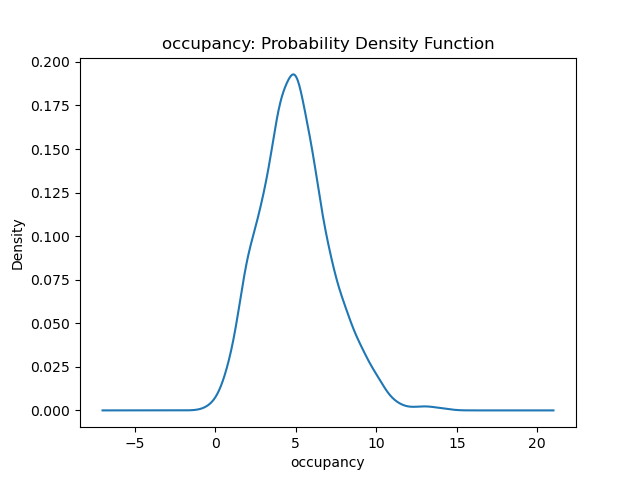
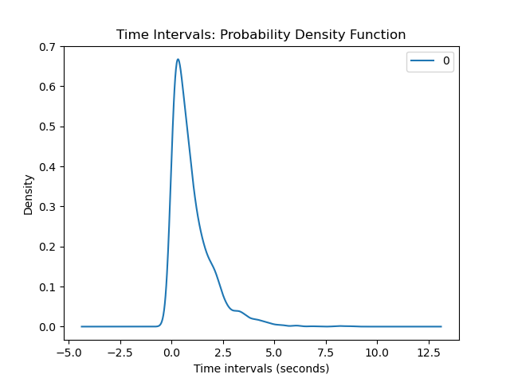

## Ethan Hung and Jason Hu Sensor Project 

**Task 0**

1. What is the greeting string issued by the server to the client upon first connecting?

  The server greets the client with "IoT server starting:  localhost port 8765". The client greets us with "ECE Senior Capstone IoT simulator".

**Task 2**

1. What are the median and variance observed from the temperature data?

  I choose lab1 for the room. The median of temperature in lab1 is 20.99 degrees and the variance is 8.57 degrees.

2. What are the median and variance observed from the occupancy data?

  I choose lab1 for the room. The median of occupancy in lab 1 is 5.0 occupants and the variance is 5.30 occupants.

3. Plot the probability distribution function for each sensor type?

4. What is the mean and variance of the time interval of the sensor readings? Please plot its probability distribution function. Does it mimic a well-known distribution for connection intervals in large systems?

  The mean of the time intervals between sensor readings is 0.99 seconds and the variance of the time intervals between sensor readings is 0.92 seconds.

**Task 3**

1. implement an algorithm that detects anomalies in **temperature** sensor data. Print the percent of "bad" data points and determine the temperature median and variance with these bad data points discarded--the same room you did in Task 2 Question 1.

2. Does a persistent change in temperature always indicate a failed sensor?

3. What are possible bounds on temperature for each room type?

**Task 4**

1. How is this simulation reflective of the real world?

2. How is this simulation deficient? What factors does it fail to account for?

3. How is the difficulty of initially using this Python websockets library as compared to a compiled language e.g. C++ websockets?

4. Would it be better to have the server poll the sensors, or the sensors reach out to the server when they have data?
