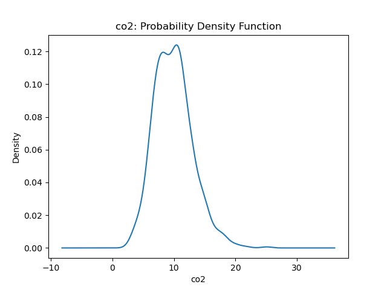

# Ethan Hung and Jason Hu Sensor Project

Data used in this report come from new.txt.

To run our solutions, use:

python analyze.py new.txt

python detect.py new.txt

## Task 0

### 1. What is the greeting string issued by the server to the client upon first connecting?

The server greets the client with "IoT server starting:  localhost port 8765". The client greets us with "ECE Senior Capstone IoT simulator".

## Task 1

In the first terminal, run:

python -m sp_iotsim.server

in another terminal, run:

python -m sp_iotsim.client -l nameoffile.txt

## Task 2

### 1. What are the median and variance observed from the temperature data?

I choose lab1 for the room. The median of temperature in lab1 is 21.004 degrees and the variance is 4.791 degrees.

### 2. What are the median and variance observed from the occupancy data?

I choose lab1 for the room. The median of occupancy in lab 1 is 5.0 occupants and the variance is 4.765 occupants.

### 3. Plot the histogram and probability distribution function for each sensor type

### 4. What is the mean and variance of the time interval of the sensor readings? Please plot its histogram and probability distribution function. Does it mimic a well-known distribution for connection intervals in large systems?

The mean of the time intervals between sensor readings is 0.996 seconds and the variance of the time intervals between sensor readings is 0.993 seconds.
The time intervals between sensor readings mimics an Erlang distribution, which is often used to model waiting times.

## Task 3

### 1. implement an algorithm that detects anomalies in **temperature** sensor data. Print the percent of "bad" data points and determine the temperature median and variance with these bad data points discarded--the same room you did in Task 2 Question 1.

### 2. Does a persistent change in temperature always indicate a failed sensor?

A persistent change in temperature does not always indicate a failed sensor. The temperature readings can change due to a variety of factors such as the air condition being turned on or a window being opened. This could cause a persistent change in temperature but this does not necessarily mean the sensor has failed. For example, if the window is left open, there can be a persistant drop in the temperature throughout the day as the outside temperature gets colder.

### 3. What are possible bounds on temperature for each room type?

Since our algorithm defines an anomoly as a point falling outside the mean ± 2*std, our bounds on temperature for each room type are given below.

office low:  17.668

office high: 27.960

class1 low:  5.601

class1 high:  48.042

lab1 low:  16.711

lab1 high:  25.466

## Task 4

### 1. How is this simulation reflective of the real world?

Simulations like these happen all the time where companies are constantly receiving data from numerous sources 24/7. With all data, there will be an high probability where we get bad data or outliers, which allows us to fix our modeling or point out things that are not working. Companies that deal with this data usually want statistics too, which is something we did in task 2 and a bit of in task 3. These statistics are usually much more specific than what we did, but it does provide a good starting point. Based on our intuition and knowledge, we will be asked about the results and our interpretation of those results. Also, the simulation uses data generated from distributions reflective of the real world. For example, the time interval data is generated using an erlang distribution, which is reflective of waiting times.

### 2. How is this simulation deficient? What factors does it fail to account for?

The simulation is deficient because it doesn't account for the changes cause by humans such as air condition being turned on or windows being left open. Depending on the time of day, these factors could affect the temperature greatly. For example, if the window is left open, the temperature will drop during the night and it is likely that air conditioning is turned off.

### 3. How is the difficulty of initially using this Python websockets library as compared to a compiled language e.g. C++ websockets?

The Python websockets library was easier compared to a compiled language. A client and server can be with a few lines of python code where as in a compiled language such as C++, it takes many more functions to set up websockets.

### 4. Would it be better to have the server poll the sensors, or the sensors reach out to the server when they have data?

I believe it would be better to have the server poll the sensors. The sensors are constantly measuring data in short time intervals so you can have a server poll the sensors only when data is required. Sensors reaching out to the server whenever they have data can potentially be very costly because of these short time intervals. Also, the server would spend a lot of time waiting if the sensors reach out whenever they have data.
